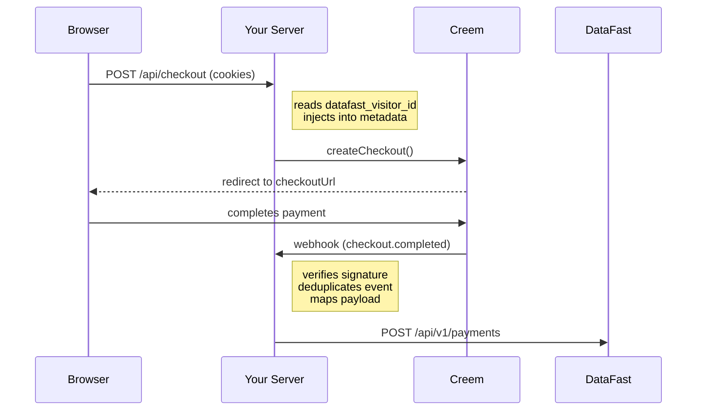

<p align="center">
  
  <br>
  <sub>×</sub>
  <br>
  
  <b>DataFast</b>
</p>

# creem-datafast

[](https://github.com/santigamo/creem-datafast/actions/workflows/ci.yml)
[](https://www.npmjs.com/package/creem-datafast)
[](https://opensource.org/licenses/MIT)
[](https://www.typescriptlang.org/)
[](https://github.com/santigamo/creem-datafast/actions/workflows/ci.yml)

Connect Creem payments to DataFast analytics without writing any glue code. One factory, automatic cookie capture, webhook forwarding.

- **Zero glue code** — one factory call wires up checkout attribution and webhook forwarding
- **Framework adapters** — Next.js App Router and Express 5 out of the box, or bring your own
- **Production-ready** — idempotent webhooks, retries with backoff, Web Crypto signature verification
- **Official Upstash adapter** — ready-made distributed idempotency for serverless and multi-instance deployments
- **Refund support** — forwards `refund.created` as `refunded: true` payment events
- **Currency-aware** — correctly converts zero-decimal (JPY) and three-decimal (KWD) currencies

## How It Works



1. Your backend calls `createCheckout()` with the incoming `Request` or cookie header.
2. The package injects `datafast_visitor_id` and `datafast_session_id` into Creem metadata without dropping the rest of your metadata.
3. Creem redirects the customer to `checkoutUrl`.
4. Creem sends `checkout.completed`, `subscription.paid`, and `refund.created` webhooks back to your server.
5. `handleWebhook()` verifies `creem-signature`, deduplicates the event id, maps the payload, and forwards the payment or refund to DataFast.

Supported events: `checkout.completed`, `subscription.paid`, `refund.created`. Any other Creem event is ignored and returns `200 OK`. Initial subscription `checkout.completed` deliveries are acknowledged but ignored so the first subscription payment is attributed only once through `subscription.paid`.

## Judge in 2 minutes

Use `example-next` for the fastest end-to-end proof. It shows the landing page, launches a real checkout, and logs both the webhook outcome and the payload forwarded to DataFast.

```bash
pnpm install
cp example-next/.env.example example-next/.env.local
```

Fill `example-next/.env.local` with real test values for `CREEM_API_KEY`, `CREEM_WEBHOOK_SECRET`, `DATAFAST_API_KEY`, `DATAFAST_WEBSITE_ID`, and `CREEM_PRODUCT_ID`. `APP_BASE_URL` can stay at `http://localhost:3000` for a local run.

```bash
pnpm build
pnpm --filter example-next dev
```

Then:

1. Open `http://localhost:3000`.
2. Click `Launch checkout via server cookie capture` to see the hosted checkout flow the package creates.
3. In another terminal, send the fixed webhook fixture already used by the test suite:

```bash
export CREEM_WEBHOOK_SECRET=your_real_webhook_secret
curl -i http://localhost:3000/api/webhook/creem \
  -H "content-type: application/json" \
  -H "creem-signature: $(node --input-type=module -e 'import { createHmac } from \"node:crypto\"; import { readFileSync } from \"node:fs\"; const rawBody = readFileSync(\"tests/fixtures/checkout-completed.json\", \"utf8\"); process.stdout.write(createHmac(\"sha256\", process.env.CREEM_WEBHOOK_SECRET).update(rawBody).digest(\"hex\"));')" \
  --data-binary @tests/fixtures/checkout-completed.json
```

You should see:

- `HTTP/1.1 200 OK` from the webhook route
- `[example-next] forwarding payload to DataFast ...`
- `[example-next] webhook processed ...`

If you prefer Express, swap the env file and dev command:

```bash
cp example-express/.env.example example-express/.env.local
pnpm --filter example-express dev
```

Use the same fixture and `curl` command against `http://localhost:3000/api/webhook/creem`. The key success signal there is `[example-express] forwarding payload to DataFast ...`.

For the longer setup, tunnel, and verification flow, see [`example-next/README.md`](./example-next/README.md), [`example-express/README.md`](./example-express/README.md), and [`docs/development.md`](./docs/development.md).

## Integrate with AI Agents

Paste this prompt into Claude Code, Cursor, Codex, or any AI coding agent:

```text
Use curl to download, read and follow: https://raw.githubusercontent.com/santigamo/creem-datafast/main/SKILL.md
```

## Installation

```bash
pnpm add creem-datafast
```

Internally the package wraps the official `creem` Core SDK, so you do not need to install `creem` separately in a normal consumer app.

## Quickstart

### Next.js

Install the package, create a shared client, then use the included route handler adapter.

```ts
// lib/creem-datafast.ts
import { createCreemDataFast } from "creem-datafast";

export const creemDataFast = createCreemDataFast({
  creemApiKey: process.env.CREEM_API_KEY!,
  creemWebhookSecret: process.env.CREEM_WEBHOOK_SECRET!,
  datafastApiKey: process.env.DATAFAST_API_KEY!,
  testMode: true
});
```

```ts
// app/api/checkout/route.ts
import { NextResponse } from "next/server";
import { creemDataFast } from "@/lib/creem-datafast";

export const runtime = "nodejs";

export async function POST(request: Request) {
  const { checkoutUrl } = await creemDataFast.createCheckout(
    {
      productId: process.env.CREEM_PRODUCT_ID!,
      successUrl: `${process.env.APP_BASE_URL!}/success`
    },
    { request }
  );

  return NextResponse.redirect(checkoutUrl, { status: 303 });
}
```

```ts
// app/api/webhook/creem/route.ts
import { createNextWebhookHandler } from "creem-datafast/next";
import { creemDataFast } from "@/lib/creem-datafast";

export const runtime = "nodejs";
export const POST = createNextWebhookHandler(creemDataFast);
```

### Express

Use the framework-agnostic core in your app layer and keep the webhook route on raw body middleware.

```ts
import express from "express";
import { createCreemDataFast } from "creem-datafast";
import { createExpressWebhookHandler } from "creem-datafast/express";

const app = express();
const creemDataFast = createCreemDataFast({
  creemApiKey: process.env.CREEM_API_KEY!,
  creemWebhookSecret: process.env.CREEM_WEBHOOK_SECRET!,
  datafastApiKey: process.env.DATAFAST_API_KEY!,
  testMode: true
});

app.post("/api/checkout", async (req, res) => {
  const { checkoutUrl } = await creemDataFast.createCheckout(
    {
      productId: process.env.CREEM_PRODUCT_ID!,
      successUrl: `${process.env.APP_BASE_URL!}/success`
    },
    {
      request: { headers: req.headers, url: req.url }
    }
  );

  res.redirect(303, checkoutUrl);
});

app.post(
  "/api/webhook/creem",
  express.raw({ type: "application/json" }),
  createExpressWebhookHandler(creemDataFast)
);
```

### Framework-Agnostic

Use `handleWebhook()` directly when your framework is not Next.js or Express. You just need the raw request body as a string and the request headers.

```ts
import { createCreemDataFast, InvalidCreemSignatureError } from "creem-datafast";

const creemDataFast = createCreemDataFast({
  creemApiKey: process.env.CREEM_API_KEY!,
  creemWebhookSecret: process.env.CREEM_WEBHOOK_SECRET!,
  datafastApiKey: process.env.DATAFAST_API_KEY!,
  testMode: true
});

// Works with any Node.js framework, and the core flow is smoke-validated on Cloudflare Workers with injected Creem/DataFast boundaries.
async function handleCreemWebhook(rawBody: string, headers: Record<string, string>) {
  try {
    const result = await creemDataFast.handleWebhook({ rawBody, headers });

    if (result.ignored) {
      return { status: 200, body: "Ignored" };
    }

    return { status: 200, body: "OK" };
  } catch (error) {
    if (error instanceof InvalidCreemSignatureError) {
      return { status: 400, body: "Invalid signature" };
    }

    return { status: 500, body: "Internal error" };
  }
}
```

### Client-Side Helper

Use the browser helper when your checkout request originates from the browser and cookies are not automatically forwarded to your backend (e.g. cross-origin fetch calls). In same-origin setups the server-side cookie capture handles this automatically.

```ts
import { appendDataFastTracking, getDataFastTracking } from "creem-datafast/client";

const tracking = getDataFastTracking();
const checkoutEndpoint = appendDataFastTracking("/api/checkout", tracking);

// Then use checkoutEndpoint as your fetch URL:
const response = await fetch(checkoutEndpoint, { method: "POST" });
```

Tracking precedence during checkout creation is:

1. `params.tracking`
2. `params.metadata.datafast_*`
3. `request.url` query params
4. cookies, using `request.headers.cookie` first and `cookieHeader` only to fill missing tracking fields

## Advanced

### Custom webhook response logic (Next.js)

If you need custom response logic in Next.js, use `handleWebhookRequest()` instead of `createNextWebhookHandler()`. It reads the raw body for you and forwards the webhook through the same core path. Since `handleWebhookRequest()` is a low-level helper, you are responsible for catching `InvalidCreemSignatureError` (-> 400) and unexpected errors (-> 500).

```ts
import { handleWebhookRequest } from "creem-datafast/next";
import { InvalidCreemSignatureError } from "creem-datafast";
import { creemDataFast } from "@/lib/creem-datafast";

export const runtime = "nodejs";

export async function POST(request: Request) {
  try {
    const result = await handleWebhookRequest(creemDataFast, request);

    if (result.ignored) {
      return new Response("Ignored", { status: 200 });
    }

    return new Response("OK", { status: 200 });
  } catch (error) {
    if (error instanceof InvalidCreemSignatureError) {
      return new Response("Invalid signature", { status: 400 });
    }

    return new Response("Internal error", { status: 500 });
  }
}
```

### Idempotency

`handleWebhook()` uses an in-process `MemoryIdempotencyStore` by default. This is convenient for local development and single-instance deployments, but it is not safe for multi-instance production environments because deduplication does not survive process restarts or span multiple instances.

Recommended production setup:

```bash
pnpm add @upstash/redis
```

```ts
import { Redis } from "@upstash/redis";
import { createCreemDataFast } from "creem-datafast";
import { createUpstashIdempotencyStore } from "creem-datafast/idempotency/upstash";

const redis = new Redis({
  url: process.env.UPSTASH_REDIS_REST_URL!,
  token: process.env.UPSTASH_REDIS_REST_TOKEN!
});

export const creemDataFast = createCreemDataFast({
  creemApiKey: process.env.CREEM_API_KEY!,
  creemWebhookSecret: process.env.CREEM_WEBHOOK_SECRET!,
  datafastApiKey: process.env.DATAFAST_API_KEY!,
  idempotencyStore: createUpstashIdempotencyStore(redis)
});
```

See [`docs/production-idempotency.md`](./docs/production-idempotency.md) for the `IdempotencyStore` contract, TTL guidance, and how to implement a custom store.

## Configuration

Constructor options for `createCreemDataFast()`:

- `creemApiKey`: Creem Core SDK API key.
- `creemWebhookSecret`: secret used to validate `creem-signature`.
- `datafastApiKey`: bearer token for DataFast payments.
- `testMode`: set to `true` to target `https://test-api.creem.io`. Defaults to `false`.
- `timeoutMs`: per-request timeout for DataFast forwarding. Defaults to `8000`.
- `retry.retries`: additional retry attempts after the initial DataFast request, so `1` means up to `2` total attempts. Defaults to `1`.
- `retry.baseDelayMs`: base backoff delay in milliseconds. Defaults to `250`.
- `retry.maxDelayMs`: maximum backoff delay in milliseconds. Defaults to `2000`.
- `strictTracking`: throw `MissingTrackingError` when no `datafast_visitor_id` is found at checkout. Defaults to `false`.
- `idempotencyStore`: custom `IdempotencyStore` for distributed deduplication.
- `logger`: inject a custom logger implementing `{ debug, info, warn, error }`.
- `creemClient`: inject a pre-configured Creem SDK instance instead of using `creemApiKey`.
- `captureSessionId`: also capture `datafast_session_id` from cookies and query parameters. Defaults to `true`.
- `hydrateTransactionOnSubscriptionPaid`: fetch the full Creem transaction for `subscription.paid` webhooks to get exact amount and timestamp. Falls back to product pricing on failure. Defaults to `true`.
- `idempotencyInFlightTtlSeconds`: seconds before an in-flight webhook claim expires, allowing redelivery. Defaults to `300`.
- `idempotencyProcessedTtlSeconds`: seconds before a completed webhook record expires. Defaults to `86400`.
- `fetch`: inject a custom `fetch` implementation for DataFast requests.

## API Reference

```ts
import {
  createCreemDataFast,
  CreemDataFastError,
  DataFastRequestError,
  InvalidCreemSignatureError,
  MissingTrackingError,
  MemoryIdempotencyStore
} from "creem-datafast";
import { createNextWebhookHandler, handleWebhookRequest } from "creem-datafast/next";
import { createExpressWebhookHandler } from "creem-datafast/express";
import { appendDataFastTracking, getDataFastTracking } from "creem-datafast/client";
import { createUpstashIdempotencyStore } from "creem-datafast/idempotency/upstash";
```

Root API:

- `createCreemDataFast(options)` — returns a `CreemDataFastClient`.
- `client.createCheckout(params, context?)` — creates a Creem checkout with injected DataFast tracking.
- `client.handleWebhook({ rawBody, headers })` — verifies, deduplicates, maps, and forwards a webhook.
- `client.verifyWebhookSignature(rawBody, headers)` — returns `true` or `false` for signature validity; throws `InvalidCreemSignatureError` when `creem-signature` is missing.

Error classes:

- `CreemDataFastError` — base class for all package errors.
- `InvalidCreemSignatureError` — webhook signature is missing or invalid.
- `MissingTrackingError` — thrown by `createCheckout()` when `strictTracking` is enabled and no `datafast_visitor_id` is found.
- `DataFastRequestError` — DataFast API request failed. Exposes `.retryable`, `.status`, and `.requestId`.

## Troubleshooting

- Invalid webhook signature: make sure the handler reads the raw request body, not parsed JSON.
- Missing `creem-signature` header: `verifyWebhookSignature()` and `handleWebhook()` throw `InvalidCreemSignatureError` because the request is malformed.
- Missing visitor tracking: the checkout still works by default; enable `strictTracking` if you want the request to fail instead.
- Double-counted revenue from DataFast: if you use the DataFast tracking script alongside server-side webhook forwarding, the same payment can be recorded twice — once by the script detecting URL parameters on the success page, and once by the webhook. Add `data-disable-payments="true"` to the DataFast script tag when using `creem-datafast` for server-side attribution.
- Wrong amount format: Creem amounts are interpreted as minor units and converted into decimal major units before sending to DataFast.
- Refund semantics: `refund.created` forwards the refunded amount as a new DataFast payment with `refunded: true` and uses the Creem refund id as `transaction_id`.
- Duplicate forwards: the built-in `MemoryIdempotencyStore` is `dev / single-instance only`. For multi-instance deployments, pass a durable atomic `idempotencyStore` such as `createUpstashIdempotencyStore(redis)`. See [`docs/production-idempotency.md`](./docs/production-idempotency.md).
- Slow or flaky DataFast responses: forwarding uses an `8000ms` timeout by default and retries only network errors, timeouts, and `408` / `429` / `5xx` responses.

## Compatibility

- Node 18+ runtime. ESM-only (`import`, not `require()`).
- Framework-agnostic core is smoke-validated on Cloudflare Workers and Bun.
- Next.js Route Handlers on the Node runtime.
- Express webhook routes using `express.raw({ type: "application/json" })`.

## Development

See [`docs/development.md`](./docs/development.md) for package checks, CI pipeline, runnable examples, and manual local verification.
