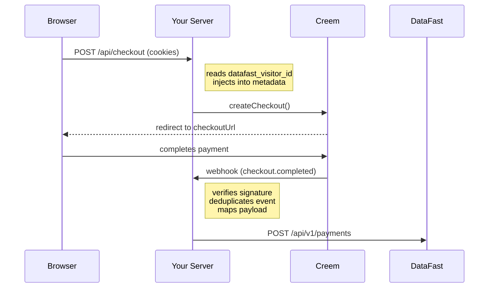

# creem-datafast

[](https://github.com/santigamo/creem-datafast/actions/workflows/ci.yml)
[](https://opensource.org/licenses/MIT)
[](https://www.typescriptlang.org/)

Connect Creem payments to DataFast analytics without writing any glue code. One factory, automatic cookie capture, webhook forwarding.

- **Zero glue code** — one factory call wires up checkout attribution and webhook forwarding
- **Framework adapters** — Next.js App Router and Express 5 out of the box, or bring your own
- **Production-ready** — idempotent webhooks, retries with backoff, Web Crypto signature verification
- **Official Upstash adapter** — ready-made distributed idempotency for serverless and multi-instance deployments
- **Refund support** — forwards `refund.created` as `refunded: true` payment events
- **Currency-aware** — correctly converts zero-decimal (JPY) and three-decimal (KWD) currencies

## What It Does

`creem-datafast` wraps the official `creem` Core SDK to handle four jobs:

- Create Creem checkouts with automatic DataFast visitor attribution.
- Read `datafast_visitor_id` and `datafast_session_id` from the request and inject them into Creem checkout metadata.
- Verify Creem webhooks with the raw body, map supported payments, and forward them to DataFast.
- Forward Creem refunds to DataFast as refunded payment events.

## Why It Exists

Connecting Creem payments to DataFast requires capturing visitor cookies at checkout, verifying webhooks, and mapping event data into DataFast's payment API. This package handles all three so you do not rebuild that glue in every project.

## How The Flow Works



1. Your backend calls `createCheckout()` with the incoming `Request` or cookie header.
2. The package injects `datafast_visitor_id` and `datafast_session_id` into Creem metadata without dropping the rest of your metadata.
3. Creem redirects the customer to `checkoutUrl`.
4. Creem sends `checkout.completed`, `subscription.paid`, and `refund.created` webhooks back to your server.
5. `handleWebhook()` verifies `creem-signature`, deduplicates the event id, maps the payload, and forwards the payment or refund to DataFast.

During checkout capture, both tracking ids are preserved in Creem metadata. During webhook forwarding, only `datafast_visitor_id` is sent to DataFast because the current DataFast payment API documents `datafast_visitor_id` but not `datafast_session_id`.

## Supported Events

- `checkout.completed`
- `subscription.paid`
- `refund.created`
- Any other Creem event is ignored and returns `200 OK` so unsupported deliveries do not trigger unnecessary retries.
- Initial subscription `checkout.completed` deliveries are acknowledged but ignored so the first subscription payment is attributed only once through `subscription.paid`.

## Installation

```bash
pnpm add creem-datafast
```

Internally the package wraps the official `creem` Core SDK, so you do not need to install `creem` separately in a normal consumer app.

## Compatibility

- Library runtime: Node 18+
- Framework-agnostic core is smoke-validated on Cloudflare Workers and Bun
- `example-express`: Node 18+ because it uses plain Express
- `example-next`: Node 20.9+ because it uses Next.js 16
- ESM-only package. Import with `import`, not `require()`.
- Next.js and Express adapters are Node-runtime integrations
- Next.js Route Handlers on the Node runtime
- Express webhook routes using `express.raw({ type: "application/json" })`
- Supported webhook events: `checkout.completed`, `subscription.paid`, `refund.created`
- Refunds are forwarded as DataFast payments with `refunded: true`

## Quickstart Next.js

Install the package, create a shared client, then use the included route handler adapter.

```ts
// lib/creem-datafast.ts
import { createCreemDataFast } from "creem-datafast";

export const creemDataFast = createCreemDataFast({
  creemApiKey: process.env.CREEM_API_KEY!,
  creemWebhookSecret: process.env.CREEM_WEBHOOK_SECRET!,
  datafastApiKey: process.env.DATAFAST_API_KEY!,
  testMode: true
});
```

```ts
// app/api/checkout/route.ts
import { NextResponse } from "next/server";
import { creemDataFast } from "@/lib/creem-datafast";

export const runtime = "nodejs";

export async function POST(request: Request) {
  const { checkoutUrl } = await creemDataFast.createCheckout(
    {
      productId: process.env.CREEM_PRODUCT_ID!,
      successUrl: `${process.env.APP_BASE_URL!}/success`
    },
    { request }
  );

  return NextResponse.redirect(checkoutUrl, { status: 303 });
}
```

```ts
// app/api/webhook/creem/route.ts
import { createNextWebhookHandler } from "creem-datafast/next";
import { creemDataFast } from "@/lib/creem-datafast";

export const runtime = "nodejs";
export const POST = createNextWebhookHandler(creemDataFast);
```

## Quickstart Express

Use the Framework-agnostic core in your app layer and keep the webhook route on raw body middleware.

```ts
import express from "express";
import { createCreemDataFast } from "creem-datafast";
import { createExpressWebhookHandler } from "creem-datafast/express";

const app = express();
const creemDataFast = createCreemDataFast({
  creemApiKey: process.env.CREEM_API_KEY!,
  creemWebhookSecret: process.env.CREEM_WEBHOOK_SECRET!,
  datafastApiKey: process.env.DATAFAST_API_KEY!,
  testMode: true
});

app.post("/api/checkout", async (req, res) => {
  const { checkoutUrl } = await creemDataFast.createCheckout(
    {
      productId: process.env.CREEM_PRODUCT_ID!,
      successUrl: `${process.env.APP_BASE_URL!}/success`
    },
    {
      request: { headers: req.headers, url: req.url }
    }
  );

  res.redirect(303, checkoutUrl);
});

app.post(
  "/api/webhook/creem",
  express.raw({ type: "application/json" }),
  createExpressWebhookHandler(creemDataFast)
);
```

## Quickstart Framework-Agnostic

Use `handleWebhook()` directly when your framework is not Next.js or Express. You just need the raw request body as a string and the request headers.

```ts
import { createCreemDataFast, InvalidCreemSignatureError } from "creem-datafast";

const creemDataFast = createCreemDataFast({
  creemApiKey: process.env.CREEM_API_KEY!,
  creemWebhookSecret: process.env.CREEM_WEBHOOK_SECRET!,
  datafastApiKey: process.env.DATAFAST_API_KEY!,
  testMode: true
});

// Works with any Node.js framework, and the core flow is smoke-validated on Cloudflare Workers.
async function handleCreemWebhook(rawBody: string, headers: Record<string, string>) {
  try {
    const result = await creemDataFast.handleWebhook({ rawBody, headers });

    if (result.ignored) {
      return { status: 200, body: "Ignored" };
    }

    return { status: 200, body: "OK" };
  } catch (error) {
    if (error instanceof InvalidCreemSignatureError) {
      return { status: 400, body: "Invalid signature" };
    }

    return { status: 500, body: "Internal error" };
  }
}
```

## Client-Side Helper

Use the browser helper when your checkout request originates from the browser and cookies are not automatically forwarded to your backend (e.g. cross-origin fetch calls). If your backend passes the incoming `{ request }` into `createCheckout()`, the server reads `datafast_visitor_id` and `datafast_session_id` from the request query string automatically. In same-origin setups the server-side cookie capture handles this automatically.

```ts
import { appendDataFastTracking, getDataFastTracking } from "creem-datafast/client";

const tracking = getDataFastTracking();
const checkoutEndpoint = appendDataFastTracking("/api/checkout", tracking);

// Then use checkoutEndpoint as your fetch URL:
const response = await fetch(checkoutEndpoint, { method: "POST" });
```

Tracking precedence during checkout creation is:

1. `params.tracking`
2. `params.metadata.datafast_*`
3. `request.url` query params
4. cookies, using `request.headers.cookie` first and `cookieHeader` only to fill missing tracking fields

Only `datafast_visitor_id` is forwarded in webhook payment payloads today. `datafast_session_id` is still worth capturing because it is stored in Creem metadata and can be forwarded later if DataFast adds documented support for it in the payment API.

## Advanced

### Custom webhook response logic (Next.js)

If you need custom response logic in Next.js, use `handleWebhookRequest()` instead of `createNextWebhookHandler()`. It reads the raw body for you and forwards the webhook through the same core path. `handleWebhookRequest()` is exported from `creem-datafast/next`, while `InvalidCreemSignatureError` stays on the root `creem-datafast` entrypoint with the rest of the framework-agnostic error types. Note that it consumes the request body stream. Since `handleWebhookRequest()` is a low-level helper, you are responsible for catching `InvalidCreemSignatureError` (→ 400) and unexpected errors (→ 500).

```ts
import { handleWebhookRequest } from "creem-datafast/next";
import { InvalidCreemSignatureError } from "creem-datafast";
import { creemDataFast } from "@/lib/creem-datafast";

export const runtime = "nodejs";

export async function POST(request: Request) {
  try {
    const result = await handleWebhookRequest(creemDataFast, request);

    if (result.ignored) {
      return new Response("Ignored", { status: 200 });
    }

    return new Response("OK", { status: 200 });
  } catch (error) {
    if (error instanceof InvalidCreemSignatureError) {
      return new Response("Invalid signature", { status: 400 });
    }

    return new Response("Internal error", { status: 500 });
  }
}
```

## Environment Variables

Package / integration:

- `CREEM_API_KEY`: Creem Core SDK API key.
- `CREEM_WEBHOOK_SECRET`: secret used to validate `creem-signature`.
- `DATAFAST_API_KEY`: bearer token for DataFast payments.

Example app only:

- `CREEM_PRODUCT_ID`: product used by your checkout endpoint.
- `APP_BASE_URL`: base URL for success redirects and local webhook setup.
- `CREEM_TEST_MODE`: example-app env var that maps to the `testMode` constructor option. Set it to `true` to target `https://test-api.creem.io`.
- `DATAFAST_WEBSITE_ID`: DataFast website ID (e.g. `dfid_xxx`) for the tracking script.
- `DATAFAST_DOMAIN`: domain registered in your DataFast dashboard.

Optional constructor hardening:

- `timeoutMs`: per-request timeout for DataFast forwarding. Defaults to `8000`.
- `retry.retries`: additional retry attempts after the initial DataFast request, so `1` means up to `2` total attempts. Defaults to `1`.
- `retry.baseDelayMs`: base backoff delay in milliseconds. Defaults to `250`.
- `retry.maxDelayMs`: maximum backoff delay in milliseconds. Defaults to `2000`.

## Idempotency

`handleWebhook()` uses an in-process `MemoryIdempotencyStore` by default. This is convenient for local development and single-instance deployments, but it is not safe for multi-instance production environments because deduplication does not survive process restarts or span multiple instances.

Recommended production setup:

```bash
pnpm add @upstash/redis
```

```ts
import { Redis } from "@upstash/redis";
import { createCreemDataFast } from "creem-datafast";
import { createUpstashIdempotencyStore } from "creem-datafast/idempotency/upstash";

const redis = new Redis({
  url: process.env.UPSTASH_REDIS_REST_URL!,
  token: process.env.UPSTASH_REDIS_REST_TOKEN!
});

export const creemDataFast = createCreemDataFast({
  creemApiKey: process.env.CREEM_API_KEY!,
  creemWebhookSecret: process.env.CREEM_WEBHOOK_SECRET!,
  datafastApiKey: process.env.DATAFAST_API_KEY!,
  idempotencyStore: createUpstashIdempotencyStore(redis)
});
```

Use a shared atomic store like this for Vercel, Railway, Render, AWS Lambda, or any horizontally scaled deployment where the same webhook may reach more than one process.

If your platform already injects Upstash env vars, `Redis.fromEnv()` works too:

```ts
import { Redis } from "@upstash/redis";
import { createUpstashIdempotencyStore } from "creem-datafast/idempotency/upstash";

const idempotencyStore = createUpstashIdempotencyStore(Redis.fromEnv());
```

See [`docs/production-idempotency.md`](./docs/production-idempotency.md) for the `IdempotencyStore` contract, TTL guidance, the official Upstash helper, and how to implement a custom store.

## Testing Local

Package checks:

```bash
pnpm build
pnpm test
pnpm typecheck
pnpm smoke:consumer
```

These same checks run in GitHub Actions on every push and pull request.

GitHub Actions validates the root package and workspace examples like this:

- `package` runs on Node 18 and 20 and checks `build`, `typecheck`, `test`, and `smoke:consumer`.
- `package` also typechecks `example-express` on Node 18 after building the root package, so the lightweight Express example stays compatible without needing a separate job.
- `cloudflare-workers-smoke` runs the built root package inside workerd via a bundled Cloudflare Worker smoke.
- `bun-smoke` packs the real tarball, installs it into an isolated Bun fixture, and exercises the async signature + webhook core flow.
- `example-next` runs on Node 20.9+ because Next.js 16 requires it, builds the root package first, then checks `typecheck` plus `build`.
- The `example-next` CI job uses placeholder env values so it validates compilation of the workspace package integration only; it does not call real Creem or DataFast services.
- `pnpm test` now includes an automated integration test that boots the real `example-express` app over HTTP and covers the full server-side attribution flow with stubbed Creem/DataFast edges.

`pnpm smoke:consumer` packs the real `.tgz`, installs it into an isolated TypeScript consumer fixture, runs `tsc --noEmit`, and verifies the root plus `next`, `express`, and `client` subpath imports at runtime.

Automated integration coverage:

- Runs against the real `example-express` runtime app over local HTTP.
- Covers checkout creation, tracking injection, webhook signature verification, event mapping, and DataFast forwarding.
- Stubs only the external Creem SDK calls and outbound DataFast request, so this remains an integration test rather than a browser E2E.
- The Express example app factory also accepts injected checkout config in tests, so runtime coverage does not depend on example env vars just to exercise `/api/checkout`.

Runnable examples:

```bash
cp example-express/.env.example example-express/.env.local
pnpm build
pnpm --filter example-express dev
```

```bash
cp example-next/.env.example example-next/.env.local
pnpm build
pnpm --filter example-next dev
```

Both examples consume the built workspace package from the repository root, so rerun `pnpm build` after changing library source before restarting or rebuilding either example.

For `example-express`, open `http://localhost:3000` and use the landing page button to start a checkout. For `example-next`, open the same URL and use the landing page button to submit `POST /api/checkout`.

Then configure the Creem webhook endpoint to `http://localhost:3000/api/webhook/creem` through your tunnel of choice.

### Manual Local Verification

1. Copy either `example-express/.env.example` or `example-next/.env.example` into the matching `.env.local` file and fill in real Creem and DataFast test credentials.
2. Run `pnpm build` at the repository root so `dist/` reflects your current library changes.
3. Start the example with `pnpm --filter example-express dev` or `pnpm --filter example-next dev`.
4. Expose `http://localhost:3000` through a tunnel such as `ngrok http 3000`.
5. Set the Creem webhook endpoint to `https://<your-tunnel>/api/webhook/creem`.
6. Open the example app, start a checkout, and complete a payment in Creem test mode.
7. Expect the example server logs to show the payload forwarded to DataFast; the Next example also logs processed versus ignored webhook outcomes explicitly.

## Troubleshooting

- Invalid webhook signature: make sure the handler reads the raw request body, not parsed JSON.
- Missing `creem-signature` header: `verifyWebhookSignature()` and `handleWebhook()` throw `InvalidCreemSignatureError` because the request is malformed.
- Missing visitor tracking: the checkout still works by default; enable `strictTracking` if you want the request to fail instead.
- Double-counted revenue from DataFast: if you use the DataFast tracking script alongside server-side webhook forwarding, the same payment can be recorded twice — once by the script detecting URL parameters on the success page, and once by the webhook. Add `data-disable-payments="true"` to the DataFast script tag when using `creem-datafast` for server-side attribution.
- Wrong amount format: Creem amounts are interpreted as minor units and converted into decimal major units before sending to DataFast.
- Refund semantics: `refund.created` forwards the refunded amount as a new DataFast payment with `refunded: true` and uses the Creem refund id as `transaction_id`.
- Duplicate forwards: the built-in `MemoryIdempotencyStore` is `dev / single-instance only`. For multi-instance deployments, pass a durable atomic `idempotencyStore` such as `createUpstashIdempotencyStore(redis)`. See [`docs/production-idempotency.md`](./docs/production-idempotency.md).
- Slow or flaky DataFast responses: forwarding uses an `8000ms` timeout by default and retries only network errors, timeouts, and `408` / `429` / `5xx` responses.

## API Reference

```ts
import {
  createCreemDataFast,
  CreemDataFastError,
  DataFastRequestError,
  InvalidCreemSignatureError,
  MissingTrackingError,
  MemoryIdempotencyStore
} from "creem-datafast";
import { createNextWebhookHandler } from "creem-datafast/next";
import { createExpressWebhookHandler } from "creem-datafast/express";
import { appendDataFastTracking, getDataFastTracking } from "creem-datafast/client";
import { createUpstashIdempotencyStore } from "creem-datafast/idempotency/upstash";
```

Root API:

- `createCreemDataFast(options)`
- `client.createCheckout(params, context?)`
- `client.handleWebhook({ rawBody, headers })`
- `await client.verifyWebhookSignature(rawBody, headers)` resolves to `true` or `false` for signature validity and throws `InvalidCreemSignatureError` when `creem-signature` is missing.

Error classes:

- `CreemDataFastError` — base class for all package errors.
- `InvalidCreemSignatureError` — webhook signature is missing or invalid.
- `MissingTrackingError` — thrown by `createCheckout()` when `strictTracking` is enabled and no `datafast_visitor_id` is found.
- `DataFastRequestError` — DataFast API request failed. Exposes `.retryable`, `.status`, and `.requestId`.

Subpaths:

- `creem-datafast/next`
- `creem-datafast/express`
- `creem-datafast/client`
- `creem-datafast/idempotency/upstash`

Next.js helpers:

- `createNextWebhookHandler(client, options?)`
- `handleWebhookRequest(client, request)`

## Integrate with AI Agents

Paste this prompt into Claude Code, Cursor, Codex, or any AI coding agent:

```text
Use curl to download, read and follow: https://raw.githubusercontent.com/santigamo/creem-datafast/main/SKILL.md
```
